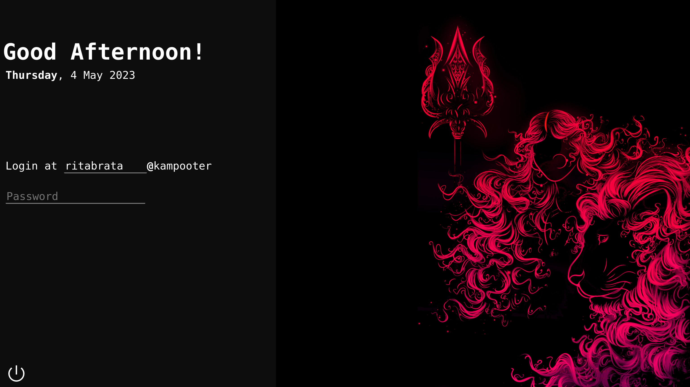

# 🔱Durvana Theme
Durvana theme is a simple theme that focuses on simplicity and cutomisibilty. It is still under development. It can also run on [nody-greeter](https://github.com/JezerM/nody-greeter/) or [web-greeter](https://github.com/JezerM/web-greeter).

# 🖼️Screenshot

# ✅TODO 
- Way to change session while logging in
- Way to change background easily
- Display succesful login after succesful login

# ❓How to Install
0. Please setup lightdm and [nody-greeter](https://github.com/JezerM/nody-greeter/), [web-greeter](https://github.com/JezerM/web-greeter) or other compatible engine.
1. Clone the reposotory into the your engine's themes folder
2. Change the configuration of your engine to run "durvana" theme
3. Enjoy!

# 🌟If you like this project
Please consider staring this project, I am actively working on it and this motivates me.
If you face any problem with this project please dont hesitate to create a new issue or [Contact me on Discord](https://discord.gg/qEYbuWu5NE)
Feel free to fork this project!