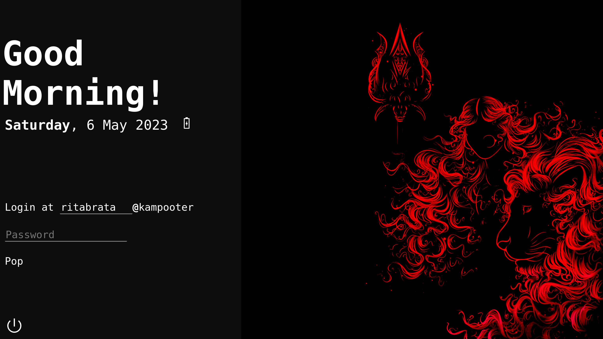

# 🔱Durvana Theme
Durvana theme is a simple webkit-based lightDM theme that focuses on simplicity and minimality. It is still under development. It can also run on [nody-greeter](https://github.com/JezerM/nody-greeter/) or [web-greeter](https://github.com/JezerM/web-greeter).

# 🖼️Screenshot

Wallpaper by [Nikhil Mishra](https://www.artstation.com/nikhilmishra_creations)

# 🎯Project's Aim
- This theme aims to be simple yet beautiful
- Not too much colourful
- Cool animations

# ⚠️Warning
**This project is under development**. Use ``Ctrl``+``Alt``+``F4`` if something goes wrong to access your computer's terminal.

# 👀Demo
[Click here for demo](https://durvana.theindiandev.in/)

# ✅TODO 
- Make it keyboard friendly
- ~~Way to change session while logging in~~(Implemented in latest commit)
- Way to change background easily
- Display succesful login after succesful login

# ❓How to Install
0. Please setup lightdm and [nody-greeter](https://github.com/JezerM/nody-greeter/), [web-greeter](https://github.com/JezerM/web-greeter) or other compatible engine.
1. Clone the reposotory into the your engine's themes folder
2. Change the configuration of your engine to run "durvana" theme
3. Change the configuration of your engine to allow access to battery if you have a laptop
    ```yaml
    features:
        battery: True
    ```
4. Enjoy!

# 🌟If you like this project
Please consider staring this project, I am actively working on it and this motivates me.
If you face any problem with this project please dont hesitate to create a new issue or [contact me on Discord](https://discord.gg/qEYbuWu5NE).
Feel free to fork this project!
